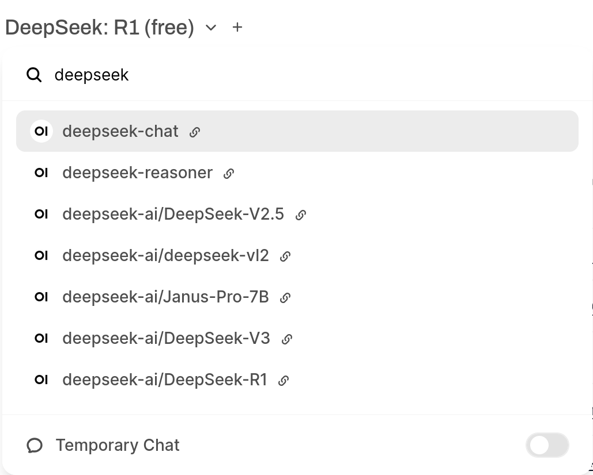

# 总之就是集合了很多API的网页UI实现

- 现在使用的搜索引擎是 `searxng`，设定每轮对话最多收集 $8$ 个网页。

官方文档: https://docs.openwebui.com/

## 开发记录
- [2025.02.07] 测试了基于 `searxng` 与 `serper` 搜索引擎的网页搜索实现。最终选择了 `searxng`。
- [2025.02.06] 基本确定了涉及的环境参数，算是不家丑外扬的水平。

## 测试过的语言模型API平台

- [OpenAI](https://platform.openai.com)
- [Deepseek](https://platform.deepseek.com)
- [硅基流动](https://siliconflow.cn)
- [OpenRouter](https://openrouter.ai)

没有对模型选择做任何过滤，在左上角可以直接搜索：

    

**注意: 大部分平台都会设置思维链长度上限，一般为 16k，建议使用思维链模型时注意**

## 已知问题
- [ ] 除`OpenAI`以外的所有思维链模型均无法正常显示思维链内容，导致空白等待时间过长，体验不佳。
- [ ] 由本地上传的知识库在检索中权重较低，导致搜索结果较差。
- [ ] `Web Search`与工具同时使用似乎存在一定问题。